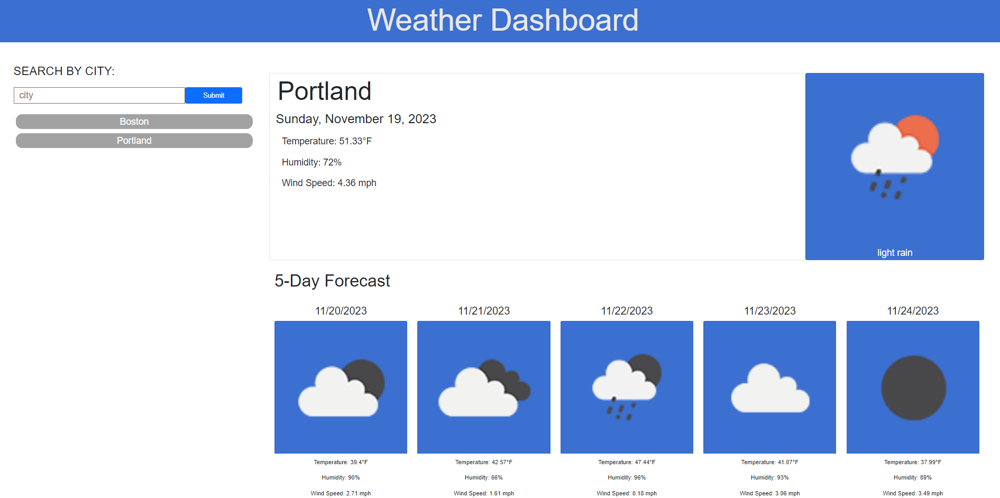

# weather-dashboard

## Description

This repository contains HTML, CSS, and JavaScript code that creates an interactive weather dashboard for users. Users can search for by city to be presented with that city's current weather conditions (temperature, humidity, wind speed, and an icon presenting the current climate), as well as the weather conditions for the next five days. Whenever a user submits a city, that city is saved for the user to be able to easily toggle back to viewing the weather conditions of that city. This repo utilizes the JQuery library so that day.js could be used in establishing dates. This repo was the first project in which I was able to use Bootstrap for styling. I found there to be many positives and negatives to Bootstrap. Specifically, I enjoyed using it for layout purposes and for ease of responsive screens. However, I found it a little difficult to learn all of the ways to utilize components of Bootstrap and how to alter their default settings. I look forward to being able to further explore Bootstrap.

## Installation

N/A

## Usage

## Credits

For this project I utilized documentation from Day.js regarding formatting of dates. I also heavily referenced Bootstrap documentation to learn of all of the different layout and components available. I found Bootstrap's documenttion of the card component to be especially helpful.

Documentation from openweather API was also used while building the fetch functions within the JavaScript code. Their documentation on geocoding and the parameters of the 5 day/3 hour api was especially helpful. All openweather API documentation can be found at their website (https://openweathermap.org/forecast5).

## Links

https://sambrez.github.io/weather-dashboard/